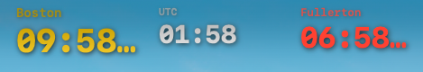
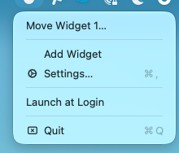
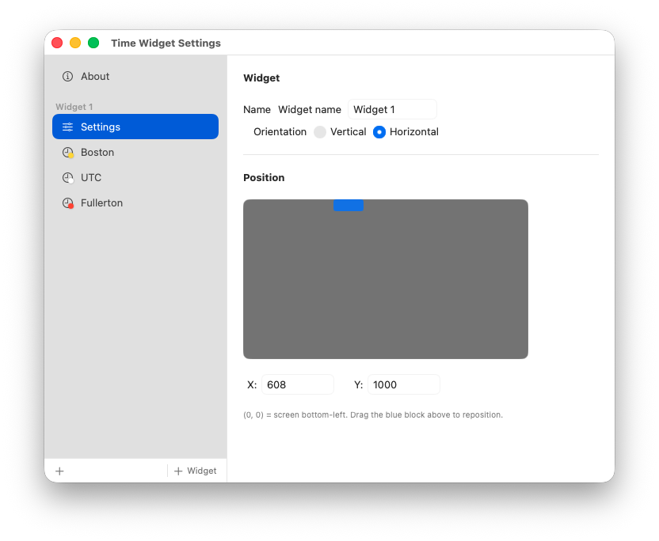
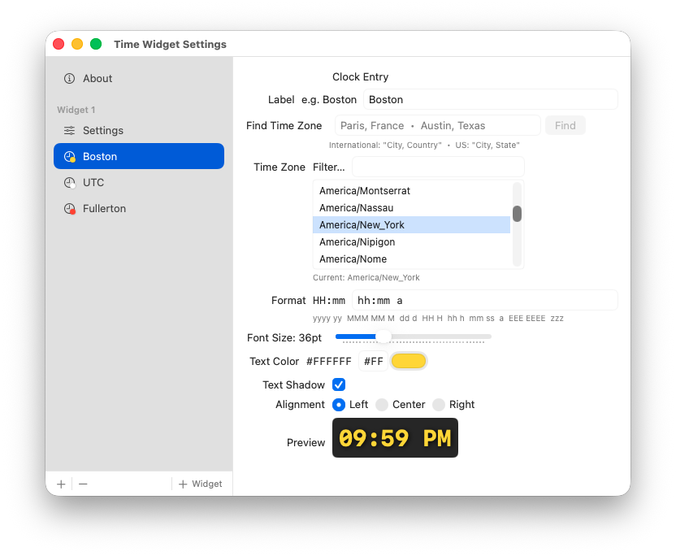
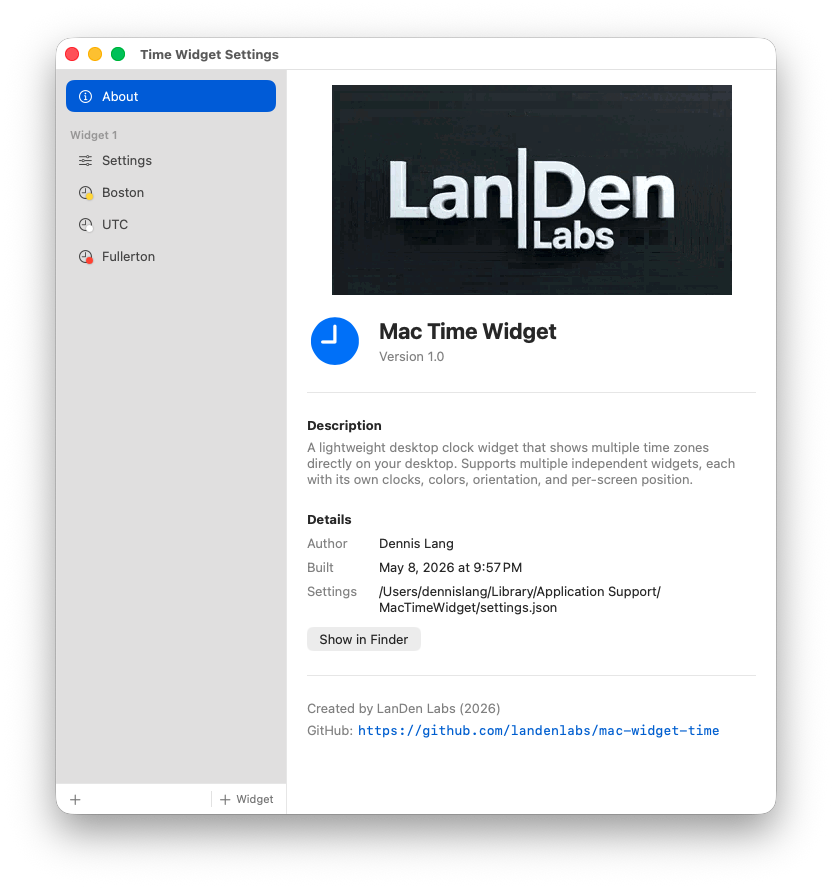

<table border="0">
  <tr>
    <td>
      <!-- VERSION -->v6.08.20
      <!-- DATE -->22-Aug-2026<br>
      macOS<br>
      <a href="https://landenlabs.com">Home</a>
    </td>
    <td>
      <a href="https://landenlabs.com">
        
      </a>
    </td>
  </tr>
</table>

# MacWidgetTime


A lightweight, transparent **World Clock desktop widget** for macOS. Displays live time for multiple cities as a borderless overlay directly on your desktop wallpaper. Supports multiple independent widgets, each with its own clocks, colors, orientation, and per-screen position.

**By [LanDen Labs](https://github.com/landenlabs) (2026)**

---

## Screenshots

**Widget on desktop — horizontal layout**



**Status bar menu**



**Widget settings — name, orientation and screen position**



**Clock entry settings — timezone, format, color, preview**



**About dialog**



---

## Features

- **Multiple independent widgets** — add as many widgets as you need, each completely independent
- **Per-widget orientation** — display clocks in a vertical stack or side-by-side horizontal row
- **Multi-city clock** — each widget shows any number of cities simultaneously
- **Transparent overlay** — sits directly on the desktop wallpaper, no Dock icon or taskbar clutter
- **Live updates** — time refreshes every second
- **Per-clock colors** — assign a custom color to each clock entry
- **City lookup** — search by city name via CoreLocation geocoding (auto-populates timezone)
- **Drag to reposition** — move each widget independently via the status bar menu
- **Per-screen position memory** — each widget remembers its position for every monitor layout
- **Custom format strings** — full `DateFormatter` format support per clock (12/24-hour, date, weekday, etc.)
- **Font size control** — 12–96pt slider per clock entry
- **Text shadow** — optional drop shadow for legibility on any wallpaper
- **Alignment** — left, center, or right align each clock entry independently
- **Launch at Login** — optional macOS login item via `SMAppService`
- **Animated About dialog** — animated logo plays once on open

---

## Requirements

- macOS 13 (Ventura) or later
- Swift 5.9 / Xcode 15 or later (to build from source)

---

## Installation

### Build from source

```bash
git clone https://github.com/landenlabs/mac-widget-time.git
cd mac-widget-time
./build_app.sh
```

This builds a release binary, packages it as `MacWidgetTime.app`, and installs it to `/Applications`. A proper `.app` bundle is required for **Launch at Login** to work — macOS can only silently relaunch bundled apps at login, not bare executables.

To build without installing, run `swift build -c release` directly; the binary will be at `.build/release/MacWidgetTime`, but it won't support Launch at Login.

---

## Usage

The app runs as a **menu bar accessory** — no Dock icon. After launch, look for the clock icon (🕐) in the menu bar.

### Status bar menu

| Item | Action |
|------|--------|
| **Move Widget N…** | Enables drag mode for that widget — drag it anywhere on the desktop, click again to lock |
| **Add Widget** | Creates a new independent widget with a default clock |
| **Remove Widget ▶** | Submenu listing each widget — select one to remove it (minimum 1 kept) |
| **Settings… ⌘,** | Opens the Settings window |
| **Launch at Login** | Toggles automatic startup at login |
| **Quit ⌘Q** | Quits the app |

---

## Settings

Open Settings via **Settings… (⌘,)** in the status bar menu.

### Sidebar

The sidebar lists all widgets as collapsible sections. Each section contains a **Settings** row and one row per clock entry.

| Bottom bar button | Action |
|-------------------|--------|
| **+** (left) | Add a clock to the focused widget |
| **−** | Remove the selected clock entry, or remove the selected widget (if more than one exists) |
| **+ Widget** | Add a new independent widget |

### Widget settings panel

Shown when **Settings** is selected under a widget section.

| Field | Description |
|-------|-------------|
| Name | Display name shown in the status bar menu and sidebar |
| Orientation | **Vertical** — clocks stacked top-to-bottom; **Horizontal** — clocks side by side |
| Position map | Click or drag the blue block to reposition the widget on your screen |
| X / Y | Exact pixel coordinates (origin = screen bottom-left) |

Positions are saved per monitor layout — connecting or disconnecting a display remembers a separate position for each configuration.

### Clock entry settings panel

Shown when a clock entry is selected in the sidebar.

| Field | Description |
|-------|-------------|
| Label | Text shown above the time (leave blank to hide) |
| Find Time Zone | Type a city name and click **Find** to auto-populate the timezone via CoreLocation |
| Time Zone | IANA timezone ID (e.g. `America/New_York`) — filterable scrollable list |
| Format | `DateFormatter` format string (e.g. `hh:mm a`, `HH:mm`, `EEE HH:mm`) |
| Font Size | 12–96pt slider |
| Text Color | Hex field + native color picker |
| Text Shadow | Toggle drop shadow |
| Alignment | Left / Center / Right |
| Preview | Live preview of the current format, color, and shadow |

**Format reference**

| Token | Meaning |
|-------|---------|
| `HH` / `H` | 24-hour hour |
| `hh` / `h` | 12-hour hour |
| `mm` | Minutes |
| `ss` | Seconds |
| `a` | AM / PM |
| `MM` / `MMM` | Month number / abbreviation |
| `dd` / `d` | Day with/without leading zero |
| `EEE` / `EEEE` | Short / full weekday name |
| `yyyy` / `yy` | 4-digit / 2-digit year |
| `zzz` | Timezone abbreviation |

Settings are saved automatically to:
```
~/Library/Application Support/MacWidgetTime/settings.json
```

The **About** dialog shows the exact path and a **Show in Finder** button.

---

## Building from Source

### Prerequisites

- macOS 13+
- Swift 5.9+ (ships with Xcode 15+) or standalone Swift toolchain

### Build (debug)

```bash
swift build
```

### Build (release)

```bash
swift build -c release
```

### Run directly

```bash
swift run
```

---

## Project Structure

```
mac-widget-time/
├── Sources/MacWidgetTime/
│   ├── main.swift                  # Entry point
│   ├── AppDelegate.swift           # Menu bar, window manager lifecycle
│   ├── AppState.swift              # Observable state, JSON persistence
│   ├── WidgetConfig.swift          # Per-widget model, orientation, screen fingerprinting
│   ├── ClockEntry.swift            # Per-clock model (timezone, format, color, etc.)
│   ├── DesktopWindowManager.swift  # Borderless window per widget, drag mode
│   ├── DesktopClockView.swift      # SwiftUI clock renderer (VStack / HStack)
│   ├── DragOverlayView.swift       # AppKit mouse-event capture for drag repositioning
│   ├── SettingsView.swift          # Settings window (sidebar + detail panels)
│   └── Resources/
│       └── landen_labs_about.gif   # Animated logo (About dialog, plays once)
├── screens/                        # Screenshot assets for README
├── Package.swift
└── README.md
```

---

## Settings File Format

```json
{
  "widgets": [
    {
      "id": "550e8400-e29b-41d4-a716-446655440000",
      "name": "Widget 1",
      "orientation": "horizontal",
      "widgetX": 608,
      "widgetY": 1000,
      "screenPositions": {
        "2560x1440@0,0": { "x": 608, "y": 1000 }
      },
      "entries": [
        {
          "label": "Boston",
          "timeZoneIdentifier": "America/New_York",
          "formatString": "hh:mm a",
          "fontSize": 36,
          "textColor": "#FFFF00",
          "shadowEnabled": true,
          "rowAlignment": "left"
        }
      ]
    }
  ]
}
```

Old single-widget settings files are automatically migrated to the new format on first launch.

---

## Credits

| Component | Source |
|-----------|--------|
| City / timezone lookup | Apple CoreLocation `CLGeocoder` |
| Timezone data | [IANA TZDB](https://www.iana.org/time-zones) via macOS |
| Animated GIF rendering | AppKit `NSImageView` + `NSBitmapImageRep` frame extraction |

---

## License

Apache © [LanDen Labs](https://github.com/landenlabs) 2026
